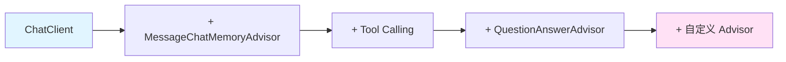

# spring-ai-agent-learning

> 一个基于 Spring AI 的渐进式 AI Agent 学习项目，用七个阶段带你从基础对话走向多 Agent 协作。

## 这是什么

本项目面向熟悉 Java 技术栈、想系统学习 AI Agent 开发的开发者。以**个人知识助理**为垂直场景，将 Agent 的核心能力拆解为七个可独立验证的阶段，每个阶段对应一个可运行的 Git Tag。

项目使用 **Spring Boot 3.4 + Spring AI 1.0.x**，所有代码均为可运行的最小示例，配合 `docs/` 下的学习笔记，帮助你理解每个能力背后的设计原理，而不只是复制粘贴。

## 学习路线

| 阶段 | 主题 | 核心能力 | Tag | 状态 |
|:---:|:---|:---|:---|:---:|
| 一 | 基础对话与 Spring AI 核心抽象 | `ChatClient`、Advisor 机制、Prompt 结构 | `v0.1-chat` | ✅ |
| 二 | 对话记忆 | `ChatMemory`、`MessageChatMemoryAdvisor`、滑动窗口 | `v0.2-memory` | ✅ |
| 三 | 工具调用 | `@Tool`、Function Calling、ReAct 循环 | `v0.3-tools` | ✅  |
| 四 | RAG 检索增强 | 文档加载、向量化、检索增强、查询重写 | `v0.4-rag` | ✅  |
| 五 | MCP 协议集成 | MCP Client / Server、标准化工具生态 | `v0.5-mcp` | ✅  |
| 六 | 多 Agent 协作 | SubAgent、Handoffs、Supervisor 模式 | `v0.6-multi-agent` | ⏳ |
| 七 | 可观测性与工程化 | 自定义 Advisor、指标、安全护栏 | `v0.7-observability` | ⏳ |

每个阶段的学习笔记位于 `docs/` 目录，包含设计原理、代码实现和核心问答。

## 为什么选择"个人知识助理"场景

这个场景天然需要 Agent 的多种核心能力：

- 需要 **RAG** 回答基于私有文档的问题
- 需要 **工具调用** 搜索网络、操作文件
- 需要 **记忆** 维持跨会话上下文
- 需要 **规划能力** 分解复杂任务
- 需要 **多 Agent 协作** 完成跨领域任务

场景边界清晰，不会因业务复杂度分散学习精力。

## 快速开始

### 环境要求

- Java 21+
- Maven 3.8+
- 一个 OpenAI 兼容的模型服务 API Key（OpenAI / DashScope / Ollama 均可）

### 三步跑起来

**1. 克隆项目**

```bash
git clone https://github.com/ningtalk/spring-ai-agent-learning.git
cd spring-ai-agent-learning
```

**2. 配置 API Key**

复制模板文件：

```bash
cp application-local.yml.example application-local.yml
```

编辑 `application-local.yml`，填入你的 API Key：

```yaml
spring:
  ai:
    openai:
      api-key: sk-你的真实key
```

> 如果使用 DashScope，同时配置 `base-url` 和 `model`，详见下方"切换模型"。

**3. 启动应用**

```bash
./mvnw spring-boot:run -Dspring-boot.run.profiles=local
```

验证：

```bash
curl "http://localhost:8080/api/chat?conversationId=test&message=你好"
```

## API 接口

### 对话接口

```http
GET /api/chat?conversationId={id}&message={msg}
```

| 参数 | 说明 |
|---|---|
| `conversationId` | 会话 ID，相同 ID 共享上下文，不同 ID 相互隔离 |
| `message` | 用户消息 |

示例：

```bash
# 第一轮
curl "http://localhost:8080/api/chat?conversationId=user-001&message=我叫小明"

# 第二轮（同一会话，模型记得上下文）
curl "http://localhost:8080/api/chat?conversationId=user-001&message=我叫什么名字？"

# 换会话（模型不知道上下文）
curl "http://localhost:8080/api/chat?conversationId=user-002&message=我叫什么名字？"
```

## 项目结构

```
spring-ai-agent-learning/
├── README.md
├── application-local.yml.example        # API Key 模板（真实配置不提交）
├── docs/                                # 分阶段学习笔记
│   ├── 01-chat-basics.md
│   ├── 02-memory.md
│   ├── 03-tool-calling.md
│   └── ...
└── src/main/java/io/github/<github-username>/agent/
    ├── config/                          # ChatClient、ChatMemory 等 Bean 装配
    ├── controller/                      # HTTP 接口，只做参数接收
    ├── service/                         # 业务逻辑，承载 ChatClient 调用
    └── SpringAiAgentLearningApplication.java
```

**分层原则**：Controller 只做参数接收，Service 承载调用逻辑，Config 负责 Bean 装配。所有 Agent 能力（记忆、工具、RAG）都通过 Advisor 链或 Builder 注入，Controller 保持稳定。

## 架构设计

### Advisor 链

Spring AI 的核心扩展点是 Advisor 机制——围绕 LLM 调用的拦截器链。每个能力都以 Advisor 的形式插入请求链路：

```
请求 → [记忆 Advisor] → [RAG Advisor] → [日志 Advisor] → LLM
                                                      ↓
响应 ← [记忆 Advisor] ← [RAG Advisor] ← [日志 Advisor] ← LLM
```

这意味着新增能力时，`ChatService` 的调用方式几乎不变，只需在 `ChatClientConfig` 中挂载新的 Advisor。

### 能力叠加



每个阶段在前一阶段基础上叠加一个能力，代码始终可运行。

## 切换模型

Spring AI 的 `ChatClient` 完全模型无关。切换模型只需修改 `application-local.yml`，Java 代码零改动。

**OpenAI**：

```yaml
spring:
  ai:
    openai:
      api-key: sk-xxx
      base-url: https://api.openai.com
      chat:
        options:
          model: gpt-4o-mini
```

**DashScope（阿里云百炼）**：

```yaml
spring:
  ai:
    openai:
      api-key: sk-xxx
      base-url: https://dashscope.aliyuncs.com/compatible-mode
      chat:
        options:
          model: qwen-plus
```

**Ollama（本地）**：

需要将 Starter 替换为 `spring-ai-starter-model-ollama`：

```yaml
spring:
  ai:
    ollama:
      base-url: http://localhost:11434
      chat:
        options:
          model: qwen2.5
```

## 按阶段学习

如果你想跟随项目的学习路径，建议：

```bash
# 查看某个阶段的完整代码
git checkout v0.2-memory

# 对比阶段之间的差异
git diff v0.1-chat v0.2-memory
```

每个 Tag 对应一个可运行的状态，配合 `docs/` 下对应的学习笔记阅读。

## 技术栈

| 层次 | 技术选型 |
|---|---|
| 语言 | Java 21 |
| 框架 | Spring Boot 3.4.x |
| AI 框架 | Spring AI 1.0.x |
| 模型接入 | OpenAI 兼容协议（可切换 OpenAI / DashScope / Ollama） |
| 构建 | Maven |
| 向量存储 | SimpleVectorStore（开发）→ PgVector（生产） |
| 会话存储 | InMemory → JDBC → Redis |

## 相关项目

学习过程中可以参考的资源：

- [Microsoft Spring AI for Beginners](https://github.com/microsoft/Spring-AI-for-Beginners) — 从零到 Agent 的完整课程
- [Spring AI 官方文档](https://docs.spring.io/spring-ai/reference/) — 权威参考
- [Spring AI Alibaba](https://java2ai.com) — 中文文档完善，多 Agent 编排参考
- [Anthropic: Building Effective Agents](https://www.anthropic.com/research/building-effective-agents) — Agent 设计模式经典

## 关于 Spring AI 与 Spring AI Alibaba

本项目**以 Spring AI 为主线**，因为前五个阶段学习的都是单 Agent 的原子能力（对话、记忆、工具、RAG、MCP），这些能力由 Spring AI 定义。

阶段六（多 Agent 协作）会引入 **Spring AI Alibaba** 作为编排框架，它基于 Spring AI 构建，提供 Graph 工作流、Multi-Agent 模式等高层能力。两者 API 兼容，可以混合使用。

## 贡献

欢迎提交 Issue 和 PR。如果你在学习过程中发现文档错误、代码问题，或想补充新的学习案例，都可以直接提 PR。

## License

[MIT](LICENSE)